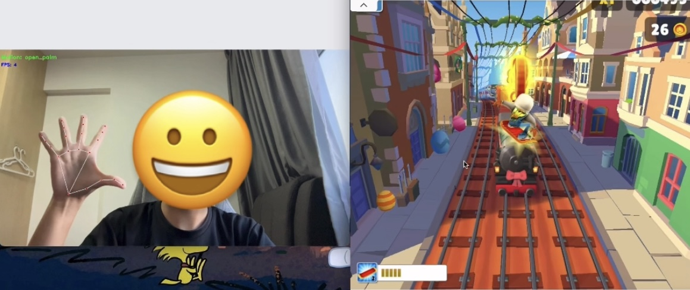

# Subway Surfers Hand Gesture Controller

### Gesture Recognition
- 🖐️ **Open Palm** → Jump (↑)
- ✊ **Closed Fist** → Slide (↓)
- ✌️ **Two-Finger Pointing Right (↗)** → Move Right (→)
- ✌️ **Two-Finger Pointing Left (↖)** → Move Left (←)

### Frameworks
- **MediaPipe Hand Landmarks** for directional gesture detection
- **MediaPipe Gesture Recognizer** model for built-in open/closed palm detection
- **OpenCV** for webcam capture
- **PyAutoGUI** for virtual keyboard control

### Demo

[Watch demo here!](https://drive.google.com/file/d/1QUasVbmTeW1NxS9VNkXwgNzefljoW05N/view?usp=drive_link)

